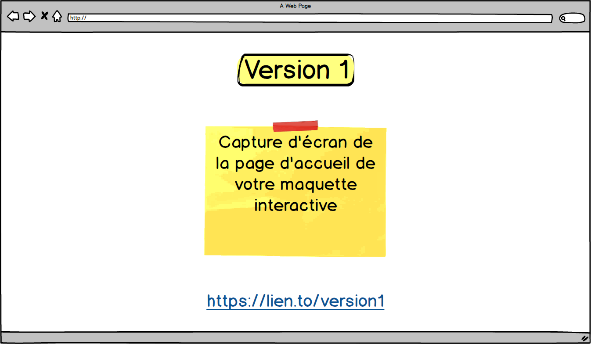

```{r setup, include=FALSE}
knitr::opts_chunk$set(echo = FALSE, warning = FALSE)
Sys.setlocale("LC_ALL", "French")
source(here::here("settings", "custom.R"))
```

# Note {.unnumbered}

Ce document présente la structure et les contenus attendus pour le rapport individuel des tests utilisateurs effectués sur la première version de la maquette. Même si certaines parties du document sont partagées avec votre collègue, l'ensemble du document doit être rédigé de manière autonome.

# Introduction

Dans cette section vous devez illustrer brièvement le contexte et fournir un aperçu général de l'ensemble du document afin que l'équipe UX et/ou le commanditaire sachent quelles informations trouver dans ces pages.

Éléments qui peuvent être utiles dans cette section :

-   Brève description du projet (finalité du site, ...)
-   Objectifs principaux du test (e.g. tester des éléments critiques dans la conception)
-   Public cible et nombre d'utilisateurs retenus pour le test
-   Nombre de problèmes majeurs rencontrés
-   *Outlook* général par rapport au test (e.g. *Le test a produit des résultats encourageants ...* ou *Le test a permis de mettre en relief plusieurs éléments critiques...*)

# Première version de la maquette

Insérez ici un bref paragraphe introductif de la première version de la maquette, ainsi qu'une capture d'écran de la page d'accueil et [le lien cliquable dans le texte](https://maltt.unige.ch)[^1], avec l'URL en note de bas de page.

[^1]: <https://maltt.unige.ch>

Faites attention par la suite de laisser cette première version intacte et accessible pour garder trace de l'évolution de votre projet dans la deuxième version. On doit pouvoir accéder à la maquette telle qu'elle était à ce stade de l'itération de votre projet.



## Principes de conception/design

Décrivez à cet endroit les choix de design les plus importantes que vous avez appliquées pour créer votre première version de la maquette. Essayez de justifier et appuyer vos choix sur des éléments concrets, issues du travail mené en ERGO I. Éléments que vous pouvez faire figurer dans cette section :

-   La palette des couleurs
-   Une description de l'architecture de l'information (e.g. menu principale) avec éventuellement une *site map*
-   Des éléments de votre *design system* qui véhiculent de l'information importante ou incitent les utilisateurs à effectuer une certaine action et explorer une certaine partie du site

## Élément critiques dans la conception

Illustrez dans cette section des éléments critiques -- par exemple des choix difficiles -- au niveau du design et qui pourraient servir de base pour une ou plusieurs tâches du test utilisateur.

# Méthodologie du test utilisateur

Décrivez dans les sous-sections les différentes éléments qui composent le test. Comme introduction général de la section, vous pouvez décrire brièvement les sous-sections. Par exemple :

*Cette section décrit les caractéristiques principales du test utilisateur effectué : le public cible visé et les participants retenus pour le test, le scénario adopté pour effectuer les tâches, la maquette sur laquelle a été effectué le test, ainsi que la procédure de passation.*

## Public cible et participants

Illustrez ici les caractéristiques du public cible visé. En cas de public cible très large, expliquez comment vous avez réduit le public potentiel. Ensuite, décrivez brièvement les participants retenus pour le test :

-   Anonymisez leurs noms, par exemple avec des pseudos ou en utilisant seulement les initiales
-   Si pertinent, ajoutez âge, sexe et profession des participants
-   Si pertinent, listez les connaissances préalables sur l'argument du site
-   Si pertinent, illustrez la fréquence d'utilisation et expertise avec les sites web

## Scénario

Décrivez dans cette section la mise en situation et illustrez la description des tâches qui a été partagée avec les utilisateurs. Pour chaque tâche, indiquez une brève labellisation qui permet ensuite de se référer facilement à la tâche dans le reste du document. Ensuite, formulez la description de la tâche telle qu'elle est présentée aux utilisateurs. La solution attendue doit apparaître de manière compréhensible. En cas de plusieurs possibilités, indiquez la solution optimale ou plus rapide, et éventuellement une alternative cohérente. Enfin, justifiez brièvement la pertinence et/ou l'intérêt de la tâche, par exemple en faisant un lien avec les informations recueillies dans les phases précedentes (e.g. analyse des besoins, personas, ...) ou les éléments critiques en phase de conception/design. Par exemple :

1.  **Recherche adresse**

-   Description : *Vous ne connaissez pas du tout ce musée et vous n'avez aucune idée d'où est-ce qu'il se trouve. Votre première préoccupation est donc de savoir s'il est proche de chez vous. Cherchez l'adresse du musée et s'il y a un plan de localisation disponible*
-   Solution : Depuis la Home > Menu principal **Contacts** > Section **Comment nous rejoindre**
-   Justification : Le musée étant nouveau et peu connu, le commanditaire a demandé que son adresse soit facilement repérable.

2.  **Prix de l'entrée**

-   Description : *Vous souhaitez visiter le musée le dimanche, avec votre partenaire et vos deux enfants de 15 et 8 ans. Combien va vous coûter l'entrée au total ?*
-   Solution : Depuis la Home > Menu principal **Tarifs** > Tableau de prix > 2x 10 Frs. (adulte) + 1x 5 Frs. (moins de 18 ans) + 1x gratuit (moins de 10 ans) = 25 Frs.
-   Justification : Plusieurs personnes interviewées pendant l'analyse de l'activité ont indiqué d'apprécier des informations précises sur les différents tarifs d'entrée au musée, notamment de pouvoir connaître les prix avant de se rendre sur place. Une analyse de la concurrence a également mis en évidence que les prix du musée sont très concurrentiels par rapport à d'autres musées dans la région.

**NB** : Vous pouvez organiser les informations comme vous voulez (liste ou tableau)

## Procédure

Illustrez dans cette section le protocole de passation de vos tests. Vous pouvez faire un résumé des éléments principaux et fournir le protocole en annexe.

Éléments qui peuvent figurer dans cette section :

-   Les conditions du test (en présence ou à distance)
-   Le déroulement (accueil, explications, débriefing, ...)
-   Le matériel technique utilisé (e.g. ordinateur, écran, ...)
-   Le matériel UX utilisé (e.g. fiche des 5 seconds, échelle UX, ...)
-   Les questions post-test

# Résultats

Illustrez dans les sous-sections les résultats obtenus. En introduction de cette section vous pouvez donner des indications générales sur le déroulement du test et signaler d'éventuelles informations pertinentes. Par exemple :

*Cette section illustre les résultats du test utilisateur. Le test s'est déroulé sans problèmes, sauf dans le cas de l'utilisateur X.Y. qui a eu un soucis de connexion. Le test a dû être interrompu pendant environ 5 minutes, mais a pu répondre normalement par la suite.*

## Test des 5 seconds

Résumé les éléments principaux ressortis grâce au test des 5 seconds. Si pertinent, vous pouvez insérez un dessin illustratif de ce que les utilisateurs retiennet de l'exposition dans le texte et ajouter les autres fiches en annexe.

## Réalisation des tâches

Proposez dans cette section un tableau récapitulatif des tâches effectuées, avec le numéro de la tâche par rapport à la liste du scénario, le temps moyen de passation, le nombre d'utilisateurs qui ont réussi la tâche, et un bref bilan . Le tableau doit présenter les colonnes suivantes :

```{r task-table}
tasks <- tibble(
  `#` = 1:2,
  `Temps` = c("0m 35sec", "1m 28sec"),
  `Réussite` = c("4/6", "6/6"),
  `Bilan` = c("Les utilisateurs en général trouve l'adresse, mais après plusieurs tentatives. Ils cherchent plutôt dans le footer de la page et dans la présentation du musée avant de cliquer sur Contacts.", "Les utilisateurs ont trouvé facilement le tableau du prix et, mis à part un peu de stress pour le calcul, ils ont trouvé le résultat assez vite.")
)

tasks %>% 
  kable(
    booktabs = T, 
    linesep = c("\\addlinespace"),
    align = "clcl",
    caption = "Synthèse des passations"
  ) %>% 
  kable_styling(full_width = F) %>%
  kable_styling(latex_options = "HOLD_position") %>% 
  column_spec(1, bold = T) %>%
  column_spec(4, width = "30em")

```

## Liste des problèmes rencontrés

Proposez ici un tableau synthétique des problèmes **majeurs** rencontrés par vos utilisateurs. Le tableau doit présenter les colonnes suivantes :

-   Numéro progressif du problème

-   Description du problème : brève description de la problématique, avec référence à une ou plusieurs tâches

-   Diagnostic : identification du problème en fonction des critères de Bastien & Scapin [-@bastienCriteresErgonomiquesPour1993]. Plusieurs critères peuvent s'appliquer à un problème

-   Taux : nombre d'utilisateur qui ont rencontré le problème sur le total des utilisateurs (e.g. 4 sur 6)

-   Gravité du problème : évaluation du niveau de gravité à spécifier éventuellement en fonction des utilisateurs (i.e. pour 1 utilisateur le problème peut être critique et pour 2 autres seulement faible). Utilisez les niveaux de gravité suivants :

    -   Critique : empêche ou décourage l'achèvement de la tache ;
    -   Sérieux : ralentit et force l'utilisateur à chercher une autre solution ;
    -   Moyen : agace, mais n'empêche pas l'achèvement de la tache ;
    -   Faible : seulement un commentaire de l'utilisateur mais ne gêne pas la progression.

```{r problems-table}
problems <- tibble(
  `#` = 1,
  `Description` = "Les utilisateurs ont du mal à trouver l'adresse du musée. Ils ne cliquent pas tout de suite sur Contacts et cherchent plutôt dans le footer de la page (Tâche 1)",
  `Diagnositic` = "Guidage > Incitation, et Compatibilité (habitude)",
  `Taux` = "4 sur 6",
  `Gravité du problème` = "Critique (2x) et Moyen (2x)"
)

problems %>% 
  kable(
    booktabs = T, 
    linesep = c("\\addlinespace"),
    caption = "Liste des problèmes majeurs rencontrés"
  ) %>% 
  kable_styling(full_width = F) %>%
  kable_styling(latex_options = "HOLD_position") %>% 
  column_spec(1, bold = T) %>%
  column_spec(2, width = "15em") %>% 
  column_spec(3, width = "10em") %>% 
  column_spec(5, width = "10em")

```

**NB** : faites figurer dans la section la légende de la gravité des problèmes

## Analyse détaillée des problèmes majeurs

Analysez de manière approfondie les problèmes les plus graves. Essayez de grouper plusieurs problèmes du tableau de synthèse dans une thématique commune, par exemple par page ou fonctionnalité du site. Pour chaque problème ou thématique, illustrez les éléments suivants :

-   Que s'est-il passé : décrire précisément ce que voulait faire l'utilisateur, la façon dont a réagi le système.
-   Quel était le problème du point de vue de l'utilisateur (insérez verbatim, copie d'écran ou indices de comportement) ?
-   Diagnostic : en utilisant la classification par critères de Bastien et Scapin ,[-@bastienCriteresErgonomiquesPour1993] identifiez les causes du problème en justifiant vos propos sur la base de vos observations ou de la littérature (scientifique ou professionnelle).
-   Remédiation proposée : que proposez-vous de changer dans le site ? Justifiez votre proposition sur la base du diagnostic et notamment de la catégorisation selon la grille de critères de Bastien et Scapin [-@bastienCriteresErgonomiquesPour1993].

Appuyez votre analyse avec des éléments multimédia (captures d'écrans, diagrammes, vidéos) qui facilitent la compréhension du problème.

## Résultats de l'échelle UX

Adaptez le titre de la sous-section pour afficher l'acronyme de l'échelle d'utilisabilité/UX que vous avez adoptée. Dans le texte, citez *in extension* le nom de l'échelle et insérez au moins une citation, par exemple la version française du questionnaire AttrakDiff [@lallemand2015] ou la *Usability Metric for User Experience* [@finstad2010].

Illustrez de manière graphique les résultats selon les items/dimensions propres à l'échelle que vous avez utilisée. Si l'échelle propose une forme de *benchmark* (i.e., comparaison par rapport à d'autres scores sur la même échelle), expliquez brièvement comme le critère de comparaison a été calculée et s'il est pertinent dans votre contexte spécifique.

Commentez de manière critique les résultats :

-   Est-ce qu'on trouve des liens entre l'évaluation de l'échelle et les problèmes rencontrés ?
-   Bilan général

## Entretien post-test

Ajoutez des informations complémentaires au test issue des questions pendant l'entretien post-test. Faites une synthèse générale et utilisez des verbatim seulement s'ils permettent vraiment de mettre en valeur le point soulevé.

## Synthèse du test utilisateur

Proposez une brève synthèse des points positifs et négatifs que les tests utilisateurs ont permis de mettre en évidence. Le texte doit être court, entre 10 et 15 lignes environ.

# Deuxième version de la maquette

Insérez à cet endroit un bref paragraphe introductif de la deuxième version de la maquette ainsi qu'une capture d'écran de la page d'accueil et [le lien cliquable dans le texte](https://tecfa.unige.ch)[^2], avec le URL en note de bas de page. Faites bien attention à utiliser un lien différent de la première version qui doit rester intacte.

[^2]: <https://tecfa.unige.ch>


## Remédiations apportées

Listez les modifications que vous avez apportées suite aux résultats du test utilisateurs ou à des décisions de design que vous avez prises entre temps. Vous pouvez grouper plusieurs modifications et les organiser en sous-sections (e.g. Modifications à la page d'accueil, Changement du menu de navigation principal, etc.).

Justifiez vos remédiations en faisant référence aux informations illustrées dans la section sur les résultats. Utilisez des références croisées pour faciliter le repère des éléments saillants sans trop dupliquer les informations. Si possible et pertinent, mobilisez à nouveau les heuristiques pour mieux décrire les remédiations apportées.

Vous pouvez appuyer vos modifications avec des captures d'écrans, mais évitez d'en mettre trop et limitez la capture aux éléments qui ont changé depuis la version précédente. Vous pouvez également combiner dans la même figure la version précédente et la version actuelle pour mettre encore plus en évidence ce qui a été modifié.

## Remédiations non apportées

Si pertinent, vous pouvez ajouter une dernière sous-sections dans laquelle vous illustrez des problèmes pour lesquels vous n'avez pas voulu ou pas pu apporter des modifications, toujours en justifiant les raisons.

# Conclusion

Cette section propose une synthèse générale du projet, comme par exemple :

-   Objectifs atteints et pas atteints

-   Futurs développements

-   Bilan général

\newpage

# Références

::: {#refs}
:::

\newpage

# Annexes

Placez ici les annexes que vous cités dans le texte.
